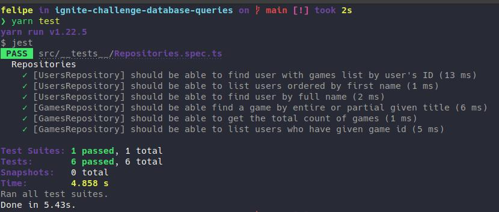

	

	<h1>Database Queries</h1>

### Summary

- [About the challenge](#about-the-challenge)

- [Tests](#Tests)

### About the challenge

- An application created in order to practice query building using TypeORM. [Click here](https://github.com/felipejsborges/ignite-challenge-database-queries/commit/99c9bd43244e218d00210ba04a9e9c29f7c1e41c) to see the implementation.

### Tests

 - **`[UsersRepository] should be able to find user with games list by user's ID`**

- **`[UsersRepository] should be able to list users ordered by first name`**

- **`[UsersRepository] should be able to find user by full name`**

- **`[GamesRepository] should be able find a game by entire or partial given title`**

- **`[GamesRepository] should be able to get the total count of games`**

- **`[GamesRepository] should be able to list users who have given game id`**
 

	
	

by Felipe Borges 
[LinkedIn](https://www.linkedin.com/in/felipejsborges) | [GitHub](https://github.com/felipejsborges)
